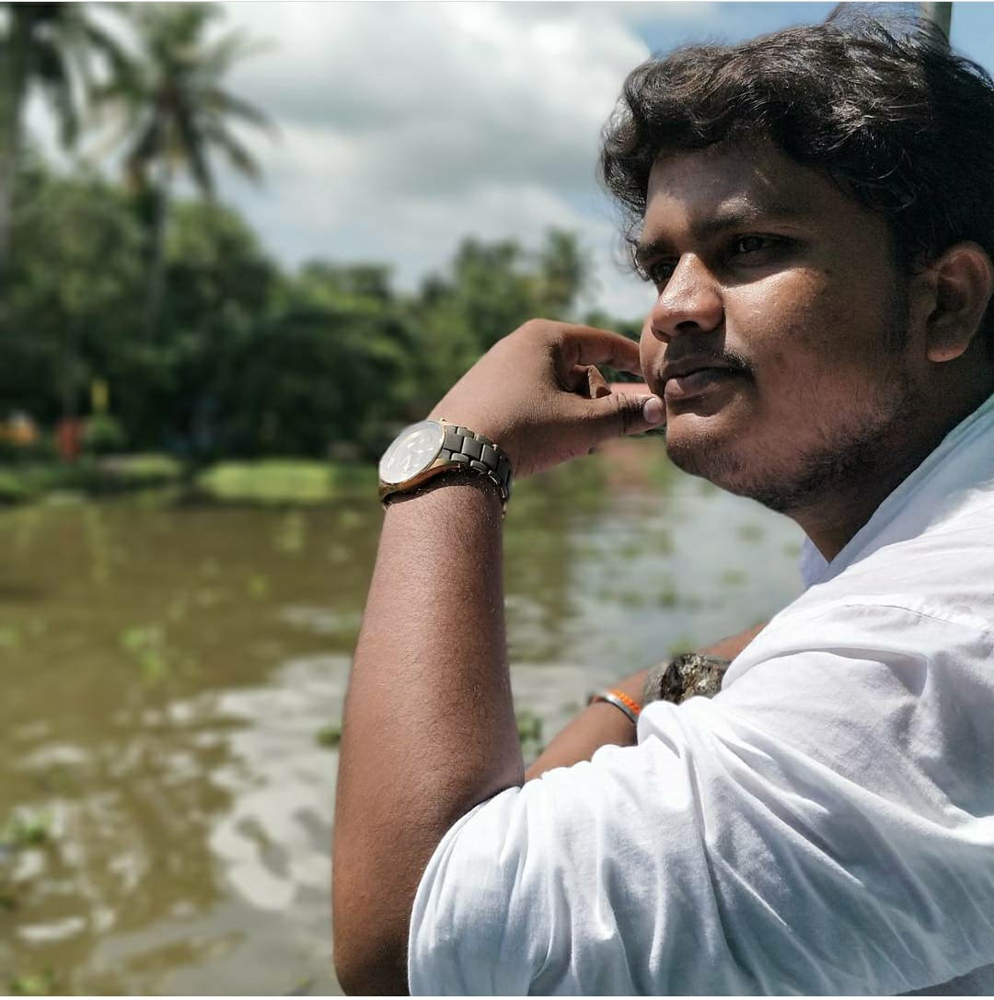

## Resume

# Hari Krishna Edvalapati

**Personal E-mail:-** eharikrishna007@gmail.com

**Work E-Mail:-** VC38455@umbc.edu
## Objective
Experienced Full Stack Engineer with a demonstrated history of working in the information technology and services industry. Skilled in Web Applications, Bootstrap, Cascading Style Sheets (CSS), AngularJS, and MongoDB. Strong engineering professional with a Bachelor of Technology - BTech focused in Electrical, Electronics and Communications Engineering from Hindustan University. Currently pursuing Masters in Data Science at University of Maryland
## Education
* Bachelors in Electronics engineering from Hindustan university, Chennai. **2015-2019**
* Persuing Masters degree at UMBC In data Science. **2021-2023**
## Skills
1. C Programming Language
2. Python Programming Language
3. HTML
4. JavaScript
5. Node Js
6. React Js
7. Matlab
8. AWS
9. GCP
10. SQL
## Work Experience
* Worked as a web Developer at **guvi geeks**
* Worked as a Data analyst at **innive Inc**
* worked as a Data visualization entusastic **innive Inc**
## Projects
* Doctor Appontment booking application using **Node js**
* Chart boat application using sockets
* interactive dashbaords for county schools using **i-360 framework**
* CURD operations application with **Angular** , **React js** and **MongoDB**
* ultrasonic **blind walking stick** for disabled people
* traet detection in gold mining using **li-fi** technology
# Achivements
* National **Second place** at 25th Teakwondo championship
* University Bandminton player
* Participated at **international teakowndo Championship** held at kolkata

## Intrests
- Surfing about new technologies
- Photography
- Travelling 
